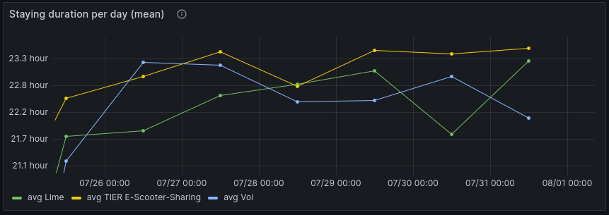
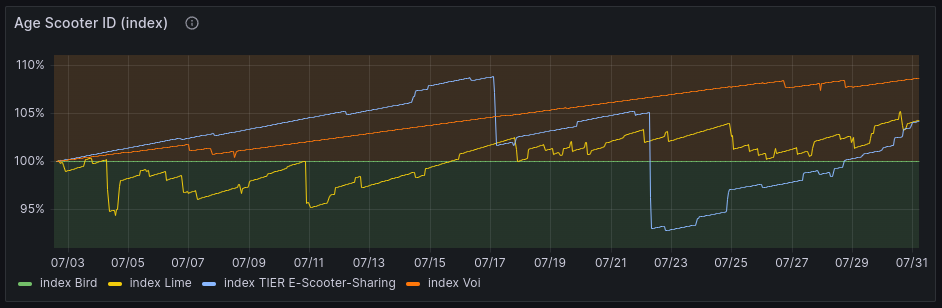

Title: E-Scooter Dashboard: Overview
Date: 2023-07-28


## Dashboards
* [Dashboard for the City of Winterthur, Switzerland](https://scooter.bardos.dev/public-dashboards/b9026fdfc46a44688708df83ffb80cf7)

## Reference
* [Documentation transformation / Git repo](https://github.com/fbardos/shared_mobility_wthur)

## Dashboard
The dashboard is built with [Grafana](https://grafana.com/) and is structured into 4 divisions:

1. Overview: Gives an overview of the selected time window with KPIs.
2. Stationary Scooter: Diagrams for data concentrating on scooters, when they do not move.
3. Moving Scooter: Diagrams focusing on scooters, when they are moving.
4. Data Quality: Indices on the health of the data on which this dashboard is built.

### Limitation
* For public dashboards, there is currently no option to add a filter for scooter providers. As soon as this is the case, I will update the dashboard to add mor functionality. You can check the status of the implementation on [Github](https://github.com/grafana/grafana/issues/67346).

### Time window
On default, the data is loaded for the past 7 days. Keep in mind, that the data only gets updated once a day (around 02:00 UTC). Therefore, data can be missing for up to the last 24 hours.
To change the time window, click on right top of the dashboard and select a time window.


Keep in mind, that all data is displayed in timezone UTC.
As soon as a new time window get selected, the new data will be automatically loaded.

### Additional info
Some charts contain aditional information for a clearer understanding. These option is marked with a small info button on the right side after the title of the chart:


### Section 1: Overview


The overview is built to give a visitor a quick overview of the data for the selected timeframe.
Expected data quality: medium (average trip distance) to high (scooters, trips), as long as the API data got updated every 10 minutes or more often.
Besides a short introduction, there are 3 different KPIs:

#### KPI: Scooters


Shows the amount of different scooter IDs collected from the API.
The number shows the mean of the available scooters in the selected time window. The graph shows the history of available scooters in the selected time window.

Good for answering question(s) like:

* How many different scooters are published on the API, on average, in the selected time window?

Not good for answering question(s) like:

* How many scooters are available for usage, on average?

#### KPI: Trips


Counts the amount of trips processed in the given time window.
The number shows the total amount of trips. The graph shows the history of trips done during the selected time window.

Good for answering question(s) like:

* How many trips were done during the selected time window?

Not good for answering question(s) like:

-

#### KPI: Trip Distance


Shows average trip distance (metric system) per trip in the selected time window.
Individual trips are first put into a hourly bin, then an average is calcuted. After that, another average is calculated for the whole time window out of these hourly bins.
Keep in mind that the mean is not the same as the median. The distribution of the trips is often shaped right skewed as there are some outliers with long distance trips.

Good for answering question(s) like:

* What is the average trip distance for the selected time window?

Not good for answering question(s) like:

* What is the median time distance for the selected time window?

### Section 2: Stationary Scooter


Contains charts for stationary data. Whenever a scooter is parked in a location, these are the charts they refer to.
Expected data quality: high, as long as the API data got updated every 10 minutes or more often.

#### Chart: Available scooter per provider


Show the counted scooter IDs per provider and 2 minute time window. Does only list scooters who are available for rental.

Good for answering question(s) like:

* How many scooters are in service and available for rental on a specific moment, per provider?

Not good for answering question(s) like:

* How many scooters are in service on a specific moment?

#### Chart: Staying duration per day


Shows the average duration, a scooter stays on the same position in bins of 24 hours. A bin starts at 00:00 and ends at 23:59:59. The lower the value, the more active the scooters of this provider is. The avarage is only calculated for scooters, whose ID was first first seen before time bin and last seen after time bin.
In reality, scooter staying duration can differ. Data gets collected every 2 minutes, so real start/stop of staying times can be blurry.

Good for answering question(s) like:

* How many hours of the day is a scooter not moving?

Not good for answering question(s) like:

* How long are scooters stationary on average and per provider?

#### Map: Stationary Scooter Position


Shows stationary scooter positions on a map, in the given time window. The longer the scooter stands on this position, the higher the weight. More weight means a more "redish" color on the map.
Stay duration to time window mapping: A particular, staying scooter is added to the chart when both start and end time of the stationary time frame are inside the selected time window on the dashboard.

Good for answering question(s) like:

* Where do scooters stay, and for how long do they stay on that specific position?

Not good for answering question(s) like:

* Where are most scooters parked?

### Section 3: Moving Scooter


Contains charts for moving scooters, from calculated trips.
Expected data quality: medium. The following prerequisites must be fulfilled for a high data quality:

* The data from tha API must be updated regularly (< 10 minutes). See section data quality for more information.
* Scooter IDs must stay the same over time. When a scooter position data has a different scooter ID every time the scooter stands on a new location, trips cannot be calculated.

#### Chart: Trip distance (meter) per day and time (hour)


Shows trip end (hour, rounded down) on the X-Axis and the average trip distance (metric) on the Y-Axis. The different bubbles are different days (Mon-Sun). The size of the bubble represents the amount of trips performed.

Good for answering question(s) like:

* How long was the average trip distance on typical Monday between 14:00 and 14:59 in a given time window?

Not good for answering question(s) like:

* What was the average trip distance on a specific Monday?

#### Map: Travel routes


Shows the travel routes of all trips in a given time window. The more trips are passing a certain route, the more "redish" the line becomes. The paths are calculated using OpenStreetmap nodes for walking. Another option would be to calculate a path for nodes with a bike. There are no nodes for scooters. During transformation, the color of the line gets calculated normalized. Therefore, when selecting different dashboard time windows, the same line color can not be compared to to other line colors of another time window.

Currently, the centric position of the map can be wrong. Additionally, the cluster numbers can block the sight to the routes. You can disable the cluster information on the top left of the map. Currently, there is no option to disable this per default. I've opened a [Github issue](https://github.com/vaduga/mapgl-community/issues/1) to address this issue.

Good for answering question(s) like:

* Which are the most used paths for scooters during trips?

Not good for answering question(s) like:

* How many trips have passed a specific position on the map?

#### Chart: Trips per day


Shows the amont of trips performed on a given day. The end time of a trip is put in a bin of 24 hours (00:00:00 to 23:59:59) and then counted, per provider.

Good for answering question(s) like:

* How many trips have ended on a given day, per provider?

Not good for answering question(s) like:

* How many trips have started on a given day?
* How long was the average trip distance of a given day?

#### Chart: Trips per hour


Shows the amont of trips performed on a given hour. The end time of a trip is put in a bin of 60 minutes (00:00 to 59:59) and then counted, per provider.

Good for answering question(s) like:

* How many trips have ended on a given hour, per provider?

Not good for answering question(s) like:

* How many trips have started on a given hour?
* How long was the average trip distance of a given hour?

#### Chart: Trip Distance, Histogram


Shows a histogram concerning the trip distance (metric) of all trips performed in a selected time window. The end time of a trip is crucial for selection into the dashboard's time window.

Good for answering question(s) like:

* What is the distribution of trip distance in the selected time window?

Not good for answering question(s) like:

* What was the average trip distance in a selected time window? Because of outliers not a good graph for this type of question.

### Section 4: Data Quality


Contains chart who can give a general advice, how good the data quality for specific time windows is.

#### Missing providers on charts
Scooter provider `Bird` does change the scooter ID very often, so no paths can be calculated. The provider will be missing in most charts in the dashboard. For example, between 2023-07-04 and 2023-07-05, there were 110k different scooter IDs for the provider Bird. This means, when the provider has about 150 scooters in Winterthur, the scooter ID will change every 2 minutes.
```bash
ipdb> context_utils.data_interval_start
    DateTime(2023, 7, 24, 2, 5, 0, tzinfo=Timezone('UTC'))
ipdb> context_utils.data_interval_end
    DateTime(2023, 7, 25, 2, 4, 59, 999999, tzinfo=Timezone('UTC'))
ipdb> gdf[gdf['provider'] == 'Bird']['id'].nunique()
    110508
ipdb> gdf[gdf['provider'] == 'Bird']['id'].nunique() / (30*24)
    153.48333333333332
```

#### Chart: Time since last update


Shows the time difference between the API extraction time and the information inside the returned data from the API, when the data was last updated. This is calculated per provider.
The higher the time distance is, the less accurate a trip can be calculated. When time difference exceeds 10 minutes, the data gets not updated as regularly as intended.
When the time difference rises for all the provider (and not just for one provder), this indicates, that either the BFE API or my collecting task were down or malfunctioning during that time.

#### Chart: Age Scooter ID


Shows the average age of the scooters, grouped by provider. The values are displayed as index with base = 100% for the beginning of the time window. As long as the average age raises over time, this indicates, that the scooter IDs do not change very often. In this case, the calculation of paths can be performed more correctly. When the average age of scooter stays the same or even decreases, this can be an indicator, that scooter trips cannot be performed correctly. In this case, the moving scooter section has be looked ad with caution. When the time window selection ends on the current day, scooter ID age can suddenly drop. This is because of the limited datapoints at the last performed data calculation at 02:05 UTC.


