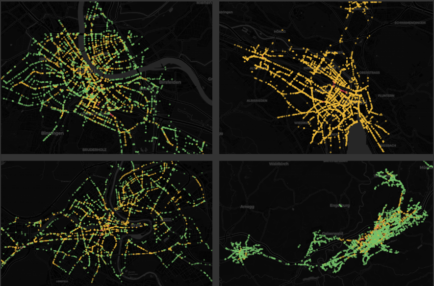

Title: One year of E-Scooter data
Date: 2024-07-05
Slug: scooter-oneyear

## Dashboards
* [Zurich, Switzerland](https://grafana.bardos.dev/public-dashboards/b6f7b7c275d747359dcb6602859a5df0)
* [Basel, Switzerland](https://grafana.bardos.dev/public-dashboards/094c36477d3d4de286e29a247ae083d4)
* [Bern, Switzerland](https://grafana.bardos.dev/public-dashboards/d3d593f0575844a9a5cd55053b2bf07a)
* [Winterthur, Switzerland](https://grafana.bardos.dev/public-dashboards/773b4473fea14b5eaa464a3d5d7d46d8)
* [St.Gallen, Switzerland](https://grafana.bardos.dev/public-dashboards/2cc3ba30e84c43938f7db016218c7de7)
* [Biel/Bienne, Switzerland](https://grafana.bardos.dev/public-dashboards/be04a0072eef47c8b0ca34baa0899153)
* [Uster, Switzerland](https://grafana.bardos.dev/public-dashboards/e6f8513db2b8405dafbe9f636d4e4ce8)
* [Frauenfeld, Switzerland](https://grafana.bardos.dev/public-dashboards/a185c2532b2c4bcaac97188dc5daede3)
* [Effretikon, Switzerland](https://grafana.bardos.dev/public-dashboards/b11e30f31a864fc29547c1109f98f145)
* [Grenchen, Switzerland](https://grafana.bardos.dev/public-dashboards/06877745c3714e3d80f613cc69e3e7d5)

For more than one year, I collected the location of the E-Scooters in Switzerland. This is possible due to the provided [API from the Swiss Federal Office of Energy (BFE)](https://opendata.swiss/de/dataset/standorte-und-verfugbarkeit-von-shared-mobility-angeboten). For approx. one year I could collect the data, after that, the ID of the scooters changed after each trip. With this modification to the API, I can no longer collect the taken trips of a specific E-Scooter. Because of that, the shown data in the dashboards ends on `2023-11-15`.

I have now published 10 dashboards for the cities and regions with available scooter data.

Some key figures:

* time range: `2022-10-16` until `203-11-15`
* collected every 2 minutes
* datapoints: 2'800'000'000
* required storage datapoints: 327 GB (MongoDB)
* required storage processed data: 38.1 GB (PostGIS)

## Processing of the data

Most of the work is done inside [Apache Airflow](https://airflow.apache.org/). For this, I wrote two DAGs:

* DAG to [collect the data](https://github.com/fbardos/shared_mobility_wthur/blob/main/airflow/dag_collect_shared_mobility.py) from the API from BFE
* DAG to [process the collected data](https://github.com/fbardos/shared_mobility_wthur/blob/main/airflow/dag_shared_mobility.py) on a daily basis

This is how the DAG for processing the data does look like:

And here is the task duration of the same DAG:

While processing a single day of data, every transformation happen inside a dedicated Docker Image, triggered by Airflow.
This means, for every processed day, 149 Docker Containers get created. With this type of design, I can decoupble the Python dependencies between Airflow and the DAGs itself.
You can find the custom written `DockerOperator` [here](https://github.com/fbardos/python_docker_operator). This custom `DockerOperator` does pass the Connections and Variables as ENV variables to the Docker Container.

Fortunately, many tasks can be run in parallel, which speeds up the execution significantly. This parallelisation can between mapped tasks, but also by tasks which are shown vertically in the image above.

Nodes and Edges for the Network Graph get imported from [OpenStreetMap](https://www.openstreetmap.org/) with the help of the Python package [osmnx](https://pypi.org/project/osmnx/). The Network is needed to then calculate possible routes from one GPS location to the next of one single scooter.

## See also
* [Original post for Winterthur describing the dashboards](https://bardos.dev/e-scooter-dashboard-overview.html)
* [Documentation transformation / Git repo](https://github.com/fbardos/shared_mobility_wthur)
