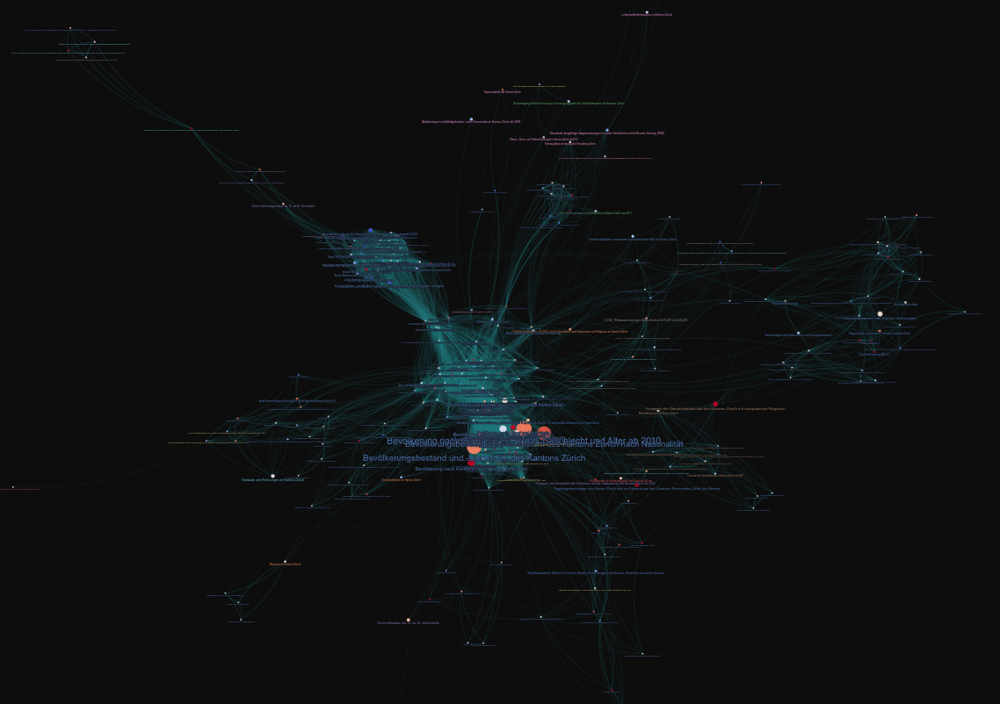
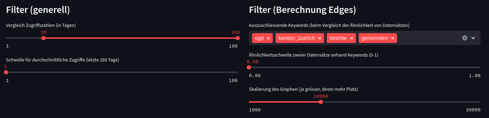

Title: Download Statistics for OGD (Canton of Zurich)
Date: 2024-02-10
Slug: ktzh-downloads



## App
* [Link to Statistics App](https://ktzh.bardos.dev)

## Reference
* [Git repo](https://github.com/fbardos/ktzh_ogd_statistics)

After my [last post](https://bardos.dev/tags-network.html) creating a network graph for the Open Data listed on [opendata.swiss](http://opendata.swiss) with [Gephi](https://gephi.org/), I searched for a solution to automatically create a nice looking graph. Luckily, I found a solution with:

* [gravis](https://robert-haas.github.io/gravis-docs/index.html)
* [NetworkX](https://networkx.org/)
* and [Streamlit](http://streamlit.io)

NetworkX is used to calculate the graph and its x/y coordinates. The network is then exported to gravis' own Graph Format called [gJGF](https://robert-haas.github.io/gravis-docs/rst/format_specification.html).
The data is passed with gJGF to Gravis and the exported to an [interactive d3 visualization](https://robert-haas.github.io/gravis-docs/rst/api/d3.html).
Thanks to the `gJGF`, additional properties can be set like `graph.metadata.background_color` or `node.metadata.hover`.

Streamlit makes it then easy to create a web application out of it with dynamic filters:


Lessions learned:

* `pandas.DataFrame.iterrows()` can be very slow indeed (like stated [here](https://stackoverflow.com/a/24871316/4856719)). But even when having to add multiple pandas operations to reach the same result, this solution can still be faster.
* When calculating edges, the cartesian product can be generated and then be filterd with `df[df['edge_id_x'] < df['edge_id_y']]`. This way, edges do not get inserted twice with `nx.Graph.add_edge`. Even the self-duplicate from the cartesian product gets excluded this way.
* Colors from a colormap can easily be mapped to a DataFrame's values with `pandas.DataFrame.map({'value1': 'color1', ...})`.
* Coordinates from NetworkX have to be mutated to be readable by gravis:
```python
pos = nx.spring_layout(G, iterations=200, scale=scale, seed=42)

# Add coordinates as node annotations that are recognized by gravis
for name, (x, y) in pos.items():
    node = G.nodes[name]
    node['x'] = x
    node['y'] = y
```
* Disable moving graph with `gravis.d3(layout_algorithm_active=False)`
