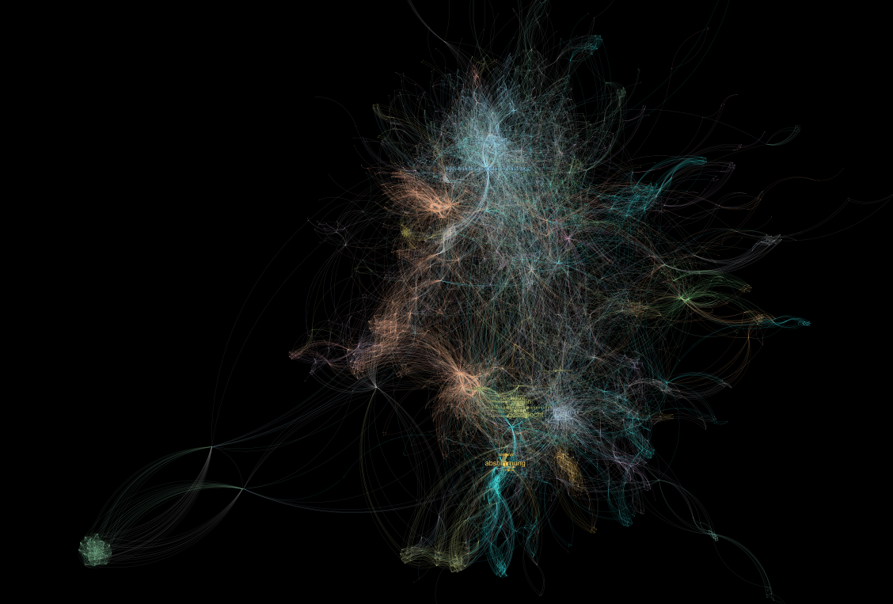
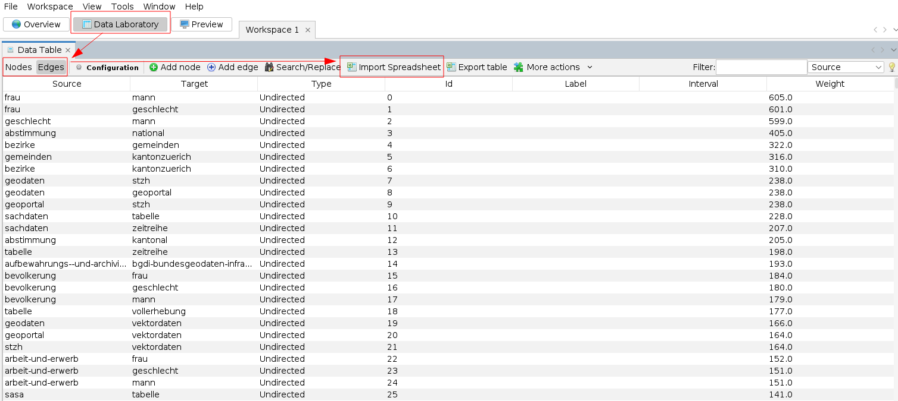
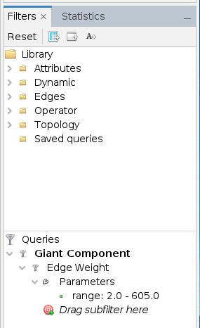
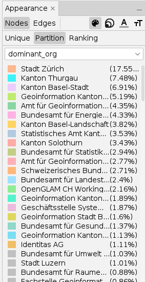
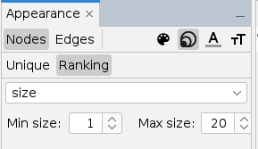
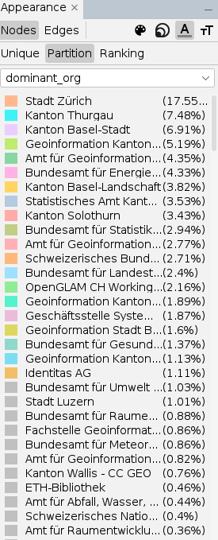
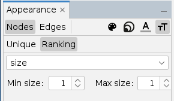
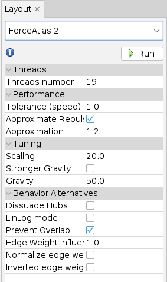
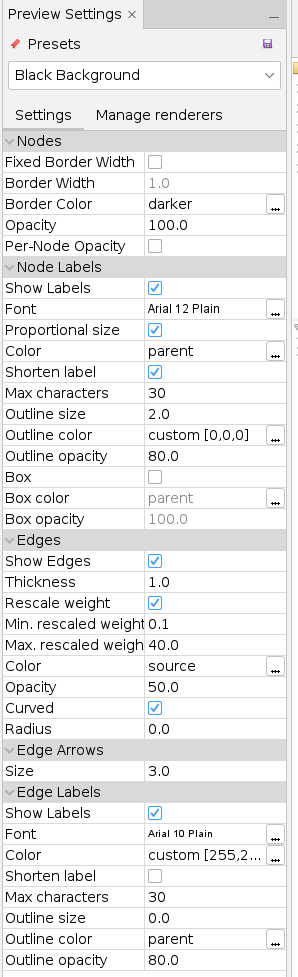
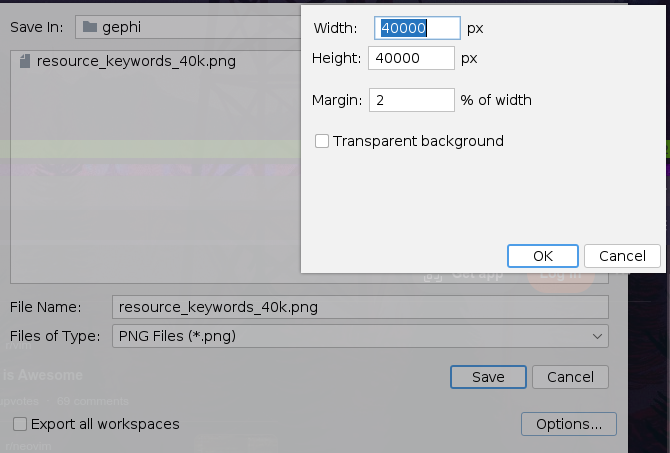

Title: OpenData.swiss Tags Network
Date: 2023-10-01
Slug: tags-network



## Links
* [Link to Tags Network on Streamlit](https://opendata-swiss-tags.streamlit.app/)
* [Git repo](https://github.com/fbardos/opendata_swiss)

## Create Graph
The network itself is created with [Gephi](https://gephi.org/). I get the data from my [daily snapshots](https://github.com/fbardos/opendata_swiss/blob/6a89519950e15532bc79b68fbcc4e55c10f923cf/dag_opendata_swiss.py) of CKAN packages from [opendata.swiss](https://opendata.swiss). But you can also collect the currently available packages from the [CKAN API](https://handbook.opendata.swiss/de/content/nutzen/api-nutzen.html).

### Collect Data
Data is collected and exported to CSV via a [custom script](https://github.com/fbardos/opendata_swiss/blob/9640a78834170a4ec168411778c71e28972b7448/gephi/build_nodes_edges.py).
The data is then used inside [Gephi](https://gephi.org/) to generate the network graph.

### Gephi

#### Nodes/Edges
Inside Gephi, I first imported the two separte CSVs for the edges and nodes (both undirected).



#### Filters
Then, I set the filters. Because of the huge amount of Edges (around 50k), I only select edges which are mentioned at least in two CKAN packages. Additionally, I want only one network. Nodes detached from the main network get filtered out.

* Remaining Nodes: 2109
* Remaining Edges: 14622



#### Apearance
In order to create a nice looking network, I set the following options for the nodes:

**Nodes Color**



**Nodes Size**



**Nodes Label Color**



**Nodes Label Size**



#### Generate Network
I was using `Force Atlas 2` to generate the network with the following config:



#### Style Preview
Then, I generated the preview with the following config:



The preview gets then exported to a PNG:




### Create Custom Tiles
When the image is exported, it's too large to display as a single image. Therefore, the images gets chopped into tiles, which can be later picked up by `folium`.
For this, I use [gdal2tiles](https://gdal.org/programs/gdal2tiles.html) with the following command:

```bash
python gdal2tiles-multiprocess.py -l -p raster -z 0-9 -w none --processes=10 <path to png> <destination folder>
```

When done, the directory gets pushed to [Github](https://github.com/fbardos/opendata_swiss/tree/9640a78834170a4ec168411778c71e28972b7448/tags_network) where the tiles can get called e.g. from Folium.

