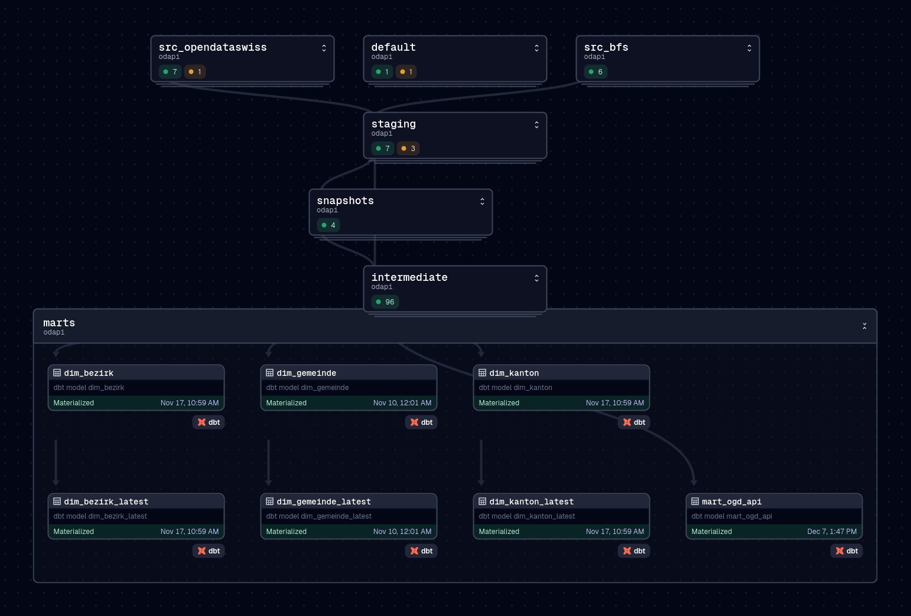
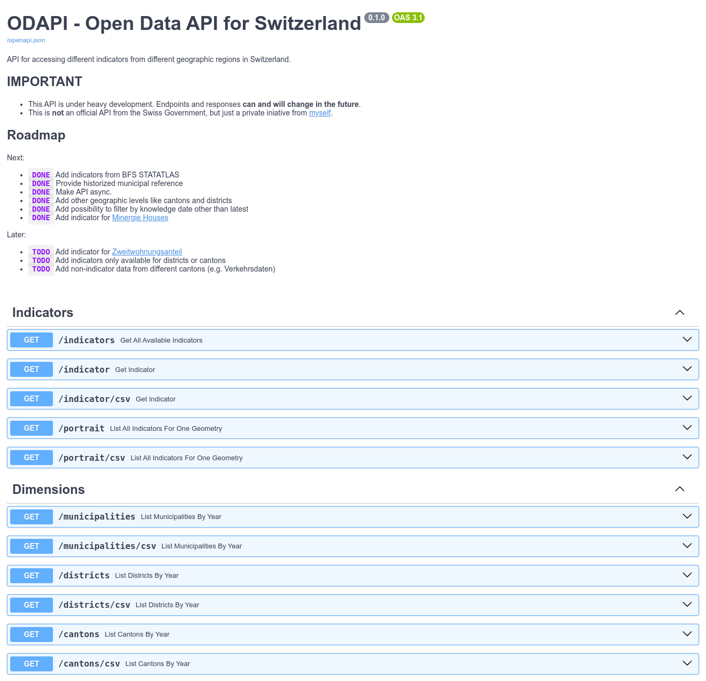
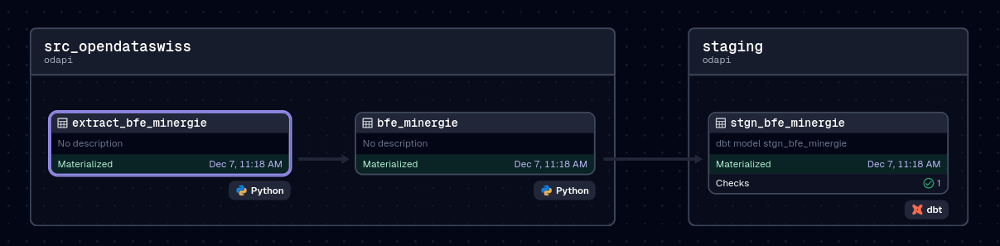
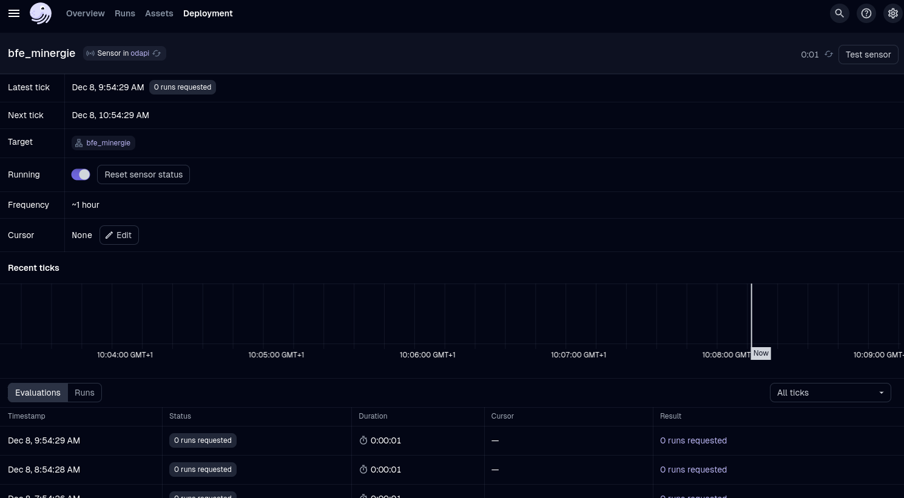
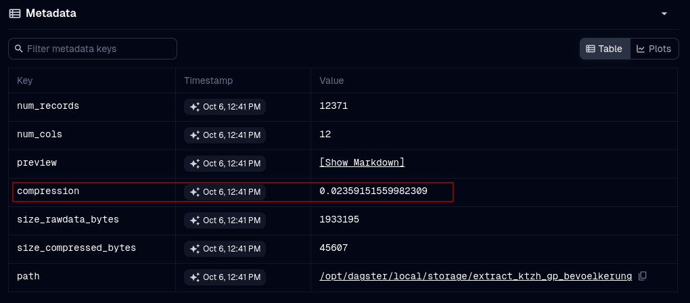
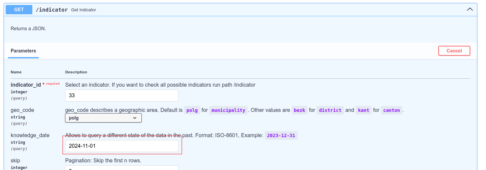
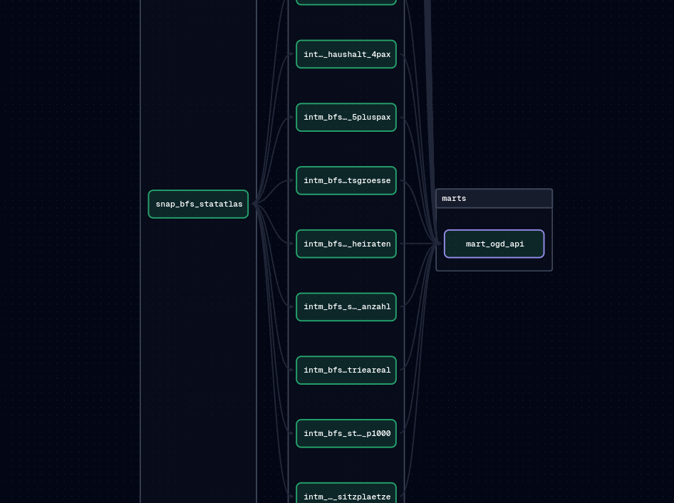
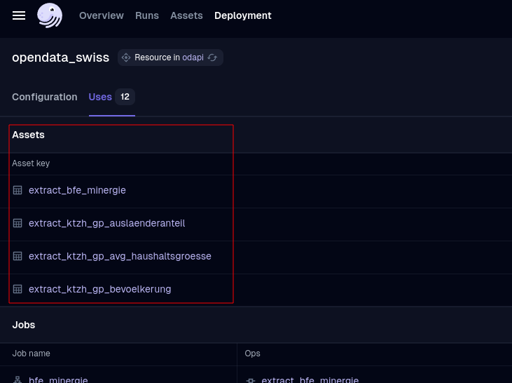

Title: Open Data API for Switzerland
Date: 2024-12-08
Slug: odapi



## Motivation

Switzerland's public institutions are publishing more and more Open Data.
As I'm writing this, 12'113 datasets got published on [opendata.swiss](https://opendata.swiss) from different organisations on national, cantonal or communal level.
Additionally, I expect that in the coming years, the growth of open data will significantly increase, because of the [EMBAG Act](https://digital.swiss/en/action-plan/measures/federal-act-on-the-use-of-electronic-means-to-conduct-official-tasks-emota), where public institutions on national level are forced to publish Open Government Data by default.

But in my opinion, there will be some challenges for the government publishing Open Data in the future:

* With all these datasets, little standardisation is done to easily connect the datasets with eachother. I think, the true value of Open Data comes, when the Data User easily can connect multiple features with eachother. So far, this work has to be done mostly by every individual Data User.
* When attending conferences on Open Data, I get the impression, that [Linked Data](https://en.wikipedia.org/wiki/Linked_data) is the solution to connect all this data with eachother. But I think, many public institutions are not on the maturity level to publish Linked Open Data yet. Linked Open Data (LOD) requires another understanding of data than the traditional, relational approach. You need to concepts like [RDF](https://en.wikipedia.org/wiki/Resource_Description_Framework) and [SPARQL](https://en.wikipedia.org/w/index.php?title=SPARQL&oldid=1258793107) etc. Some Authorities are definitly more mature in their transformation of Open Data, like the City of Zurich or Basel. But the vast majority is between level 1 or 3 on the 5-star Open Data Model. Additionally, I miss standardized definitions for timely data.


*[5-Star](https://5stardata.info/en/) Open Data Model*

Don't get me wrong, I love to see this many Open Data from the Swiss Government.
And I'm certain: All these Open Data provides a huge benefit for the general public.
But the surplus of all this data could be improved further, when the data gets connected with eachother, without overburden the Users and Producers of Open Data.

So, I got an idea: Why not try to provide a curated API with data on indicators for municipalities, districts and cantons?
This would be a start to connect all these data better together. Honestly, I'm not sure, if this is the right approach, but I want to try it.
Maybe Linked Open Data get established more faster than I thought, then, this API would be obsolete (and I would be happy to know, that Linked Open Data is now established in Switzerland and worldwide).

## API

The current version of the mentioned API can accessed here:

* [ODAPI - Open Data API for Switzerland](https://odapi.bardos.dev/)
* [Source Code (Github)](https://github.com/fbardos/odapi)



*Documentation for ODAPI*

So far, I built endpoints for:

* **indicators**: Get all available indicators available on a specific geometry level, like municipality, district or canton.
* **indicator**: Get data for a single indicator.
* **portrait**: Get all available indicator per municipality, district or canton.
* **dimensions**: Get borders for municipality, district or canton, historized since 1850.

To improve the usability of the data, I added the possibility to get data from the endpoint `indicator` or `portrait` by CSV.
This way, the response from the API can easily be passed to tools like [pandas](https://pandas.pydata.org/), just by using a parametrized URL:

```bash
In [1]: import pandas as pd

In [2]: pd.read_csv('https://odapi.bardos.dev/portrait/csv?geo_code=polg&geo_value=230&knowledge_date=2024-12-07&join_indicator=false&join_geo=false&join_geo_wkt=false&period_ref=2023-12-31').head(5)
Out[2]:
   indicator_id geo_code  geo_value         knowledge_date_from  knowledge_date_to period_type period_code period_ref_from  period_ref  indicator_value_numeric indicator_value_text                                             source
0             1     polg        230  2024-10-05 11:22:12.235047                NaN     duedate        year             NaN  2023-12-31                 118989.0                  NaN                Gemeindeportrait des Kantons Zürich
1             2     polg        230  2024-10-05 11:22:58.060772                NaN     duedate        year             NaN  2023-12-31                     26.0                  NaN                Gemeindeportrait des Kantons Zürich
2             5     polg        230  2024-10-05 12:20:34.266065                NaN     duedate        year      2023-01-01  2023-12-31                     17.9                  NaN  BFS – Statistik der Bevölkerung und der Hausha...
3             8     polg        230  2024-10-05 12:20:34.266065                NaN     duedate        year      2023-01-01  2023-12-31                      0.5                  NaN  BFS – Statistik der Bevölkerung und der Hausha...
4             7     polg        230  2024-10-05 12:20:34.266065                NaN     duedate        year      2023-01-01  2023-12-31                     17.4                  NaN  BFS – Statistik der Bevölkerung und der Hausha...
```

## Tooling
In the recent months, I worked heavily with [DBT](https://www.getdbt.com/) and [Dagster](https://dagster.io/).
In this post, I want to explain, why I think, DBT and Dagster form a perfect match.
The following chapters will introduce you in the tools sourcing the Open Data API.

## DBT
[DBT](https://www.getdbt.com/) is a mighty tool for Data Engineers to easily build a database which provides analytical data.
You build your analytical tables just by using `SELECT` statements from SQL. And because almost all Data Engineers are familiar with SQL, DBT can easily be learned.
Another important feature is the possibility to generate SQL with [Jinja](https://jinja.palletsprojects.com/en/stable/), which let you to dynamically generate SQL queries.

#### DBT model
Models are a core feature of DBT. A model as materialization in a selected database, usually a database table or a view.
Here is an example of a simple model:

```jinja
select *
from {{ ref('stgn_bfe_minergie') }}
```

This query will load all rows and columns from the table in the `FROM` clause.
In DBT, other models get referenced with the `ref()` function. DBT then automatically replaces this jinja function with the correct database schema and table name, once the SQL of the model gets parsed.

A model can also be configured. Here is an example:

```yaml
models:
  - name: stgn_bfs_statatlas  # name of the model
    config:
      group: staging  # group models, represent in a db schema
      materialized: view  # represent model as a database view
      indexes:  # let dbt generate a table index
        - columns: [gemeinde_bfs_id]
          unique: false
    tests:  # add tests to a model (here: on level table)
      - dbt_utils.unique_combination_of_columns:  # test primary key
          combination_of_columns: ['mother_path', 'map_id', 'geo_id', 'variable']
```

A model config can also contain configuration and tests for columns. This gives you later a documentation on column level.

Because DBT tracks the lineage graph for the data pipeline, you can regenerate models downstream very easily, when you changed the logic of a upstream model.
Let's assume, you changed the model `intm_swissboundaries_kanton` and want to regenerate this model and all downstream models.
For this, execute a `dbt run`, followed by `dbt test`, and DBT executes all models and runs preconfigured data tests on it. The `+` after the model name indicates, that you want to run this and all downstream models.

```bash
$ dbt run -s intm_swissboundaries_kanton+ && dbt test -s intm_swissboundaries_kanton+

  Running with dbt=1.8.2
  Registered adapter: postgres=1.8.2
  Found 113 models, 4 snapshots, 2 seeds, 378 data tests, 15 sources, 814 macros, 4 groups

  Concurrency: 12 threads (target='dev')

  1 of 3 START sql table model dbt_intermediate.intm_swissboundaries_kanton ...... [RUN]
  1 of 3 OK created sql table model dbt_intermediate.intm_swissboundaries_kanton . [SELECT 4380 in 29.03s]
  2 of 3 START sql table model dbt_marts.dim_kanton .............................. [RUN]
  2 of 3 OK created sql table model dbt_marts.dim_kanton ......................... [SELECT 4407 in 1.26s]
  3 of 3 START sql table model dbt_marts.dim_kanton_latest ....................... [RUN]
  3 of 3 OK created sql table model dbt_marts.dim_kanton_latest .................. [SELECT 27 in 0.06s]

  Finished running 3 table models in 0 hours 0 minutes and 30.57 seconds (30.57s).

  Completed successfully

  Done. PASS=3 WARN=0 ERROR=0 SKIP=0 TOTAL=3
  Running with dbt=1.8.2
  Registered adapter: postgres=1.8.2
  Found 113 models, 4 snapshots, 2 seeds, 378 data tests, 15 sources, 814 macros, 4 groups

  Concurrency: 12 threads (target='dev')

  1 of 1 START test dbt_utils_unique_combination_of_columns_intm_swissboundaries_kanton_snapshot_date__kanton_bfs_id  [RUN]
  1 of 1 PASS dbt_utils_unique_combination_of_columns_intm_swissboundaries_kanton_snapshot_date__kanton_bfs_id  [PASS in 0.05s]

  Finished running 1 test in 0 hours 0 minutes and 0.21 seconds (0.21s).

  Completed successfully

  Done. PASS=1 WARN=0 ERROR=0 SKIP=0 TOTAL=1
```

### Dagster
[Dagster](https://dagster.io/) is a data pipeline orchestrator, to manage pipeline execution. More powerful than [cron](https://en.wikipedia.org/wiki/Cron) jobs and in my view a possible successor for [Apache Airflow](https://airflow.apache.org/). Dagster lets you to define the pipelines as code, managed in a project specific Python package.
Dagster is designed to natively support the DBT ecosystem. Models from DBT get recognised, and get displayed in an embedded lineage graph, together with the additional Dagster Assets and Ops.

#### Dagster asset
A core concept of Dagster are [assets](https://docs.dagster.io/concepts/assets/software-defined-assets). In a nutshell, an asset is materialized data stored somewhere.
This can be a file on S3, a materialized table on a database or something else.
Multiple assets together can form a data pipeline and can be executed in a [job](https://docs.dagster.io/concepts/ops-jobs-graphs/jobs), triggered by a [sensor](https://docs.dagster.io/concepts/partitions-schedules-sensors/sensors) or [schedule](https://docs.dagster.io/concepts/automation/schedules).

When using Dagster together with DBT, it is common to first load all DBT models into Dagster, then add specific assets before or after the DBT models.
For example, assets before DBT can load data into the staging area of DBT, assets after DBT can generate artefacts like CSVs to be published somewhere.

In the below example, two Dagster assets get executed, then the first dbt model consumes the data.


*Lineage Graph in staging area*

### Architecture
The data for the API passes through the following stages:

* Sourcing: Loading data from external websites like [opendata.swiss](https://opendata.swiss) or the Website from the [Federal Statistical Office BFS](https://www.bfs.admin.ch/bfs/en/home.html) and store the downloaded file.
* Staging: Load the downloaded file into the staging area of the database. Snapshot data if needed with [DBT Snapshots](https://docs.getdbt.com/docs/build/snapshots).
* Intermediate: Apply business logic to the data, which can later be consumed.
* Marts: Final tables to be exposed by the API

A graphical representation can be viewed on the thumbnail on this post.

#### Trigger snapshot upon modified Open Data

Because [opendata.swiss](https://opendata.swiss) follows the standard [DCAT-AP-CH](https://www.dcat-ap.ch/), the metadata of Open Data contain the `modified` attribute.
With Dagster, I can periodically check this attribute to trigger the full pipeline execution, as soon as the source data gets updated.
By doing this, data for ODAPI gets automatically updated, once the data gets updated from the source. This is done with a Dagster [sensor](https://docs.dagster.io/concepts/partitions-schedules-sensors/sensors).

Here is an example of such a sensor:

```python
@sensor(name=asset_name, job_name=job_name, minimum_interval_seconds=60 * 60)
def _sensor(
		opendata_swiss: OpenDataSwiss,
		xcom: XcomPostgresResource,
	):

	last_execution_str = xcom.xcom_pull(f'last_execution_{asset_name}')
	if last_execution_str is None:
		last_execution = dt.datetime(1970, 1, 1, tzinfo=timezone('Europe/Zurich'))
	else:
		assert isinstance(last_execution_str, str)
		last_execution = dt.datetime.fromisoformat(last_execution_str)

	last_modified = opendata_swiss.get_resource_modified(resource_id)
	assert isinstance(last_modified, dt.datetime)

	if last_modified > last_execution:
		yield RunRequest(run_key=job_name)
```

How it looks on the UI:



*Dagster Sensor*

#### Store compressed history of the source data
With every update on the source data, the data gets downloaded and stored on a S3 compatible bucket on [Minio](https://min.io/).
The data gets later snapshoted on DBT itself. This file export is just needed in an emergency, when something went wrong downstream.
Because I do not expect to use this data regularly, it can be compressed. For this, I convert the original data into a parquet file and use a `snappy` compression. Then, I [Gzip](https://www.gnu.org/software/gzip/) the parquet file again, before storing it on Minio.
With this approach, I can compress some data to 2% of the original CSV filesize:


*Compression size, measured from the original filesize*

#### Using DBT snapshots to provide a knowledge date
Data changes over time, even for years in the past. Reasons could be a faulty data transformation or the definition of an indicator has changed.
To get another state of the data from the past, data must be historized.
With [DBT Snapshots](https://docs.getdbt.com/docs/build/snapshots), data can be stored according to [SCD-Type2](https://en.wikipedia.org/wiki/Slowly_changing_dimension).
If a row has changed, the old record gets invalidated by setting the column `dbt_valid_to` to the current date and insert the new row with `dbt_valid_from == curent date`.
This logic can be passed downstream until the mart, serving the API.

In the API, you can "restore" an old state by inserting a date in the past:


*ODAPI custom knowledge date*

#### Custom DBT model config
With the [import](https://bardos.dev/statatlas-export.html) of the [STATATLAS](https://www.bfs.admin.ch/bfs/en/home/statistics/regional-statistics/atlases/interactive-statistical-atlas-switzerland.html) data, many different indicators get loaded into one big table.
During the intermediate phase of the data transformation, these big table needs to be splitted by indicator:


*Graph for splitting the STATATLAS data*

Without some sort of automation, this would be a very repetitive task and not really maintainable.
So, I wrote DBT macro, which reads config options directly from the model configuration, stored in a YAML file. Here is an example of such a model config:

```yaml
models:
  - name: intm_bfs_statatlas_whg_energiequelle
    config:
      odapi:
        indicator: 67
        period_type: duedate
        period_code: year
      intm_statatlas:
        indicator_regex: 'Dominierende Energiequelle'
        path_regex:
          - '^_?\d+_17205_17198_17188_169_?$'  # 09 - Bau / Energie / Wohnungen / Dominierende Energiequelle
        value_col: desc_val
        value_col_is_text: true
        period_ref_from_transformation: "substring(period_ref, '^[0-9]{4}-[0-9]{2}-[0-9]{2}')::DATE"
        period_ref_transformation: "substring(period_ref, '[0-9]{4}-[0-9]{2}-[0-9]{2}$')::DATE"
    tests:
      - <<: *tests-intm-table-statatlas-pk
      - <<: *tests-intm-table-statatlas-cols
      - <<: *tests-intm-table-statatlas-rows
      - <<: *tests-intm-table-statatlas-rowsmin
```

In this model, I used modularization on 3 levels:

* The data tests (key: `tests`) is a YAML group, which can be referenced by every other DBT model in the YAML file.
* I inserted a custom key inside the `config` key called `odapi`. Here, ODAPI-specific configs are set like the indicator ID of the model. This gets later inserted into SQL during the parsing of the DBT model.
* To get the right variables from the big STATATLAS table, I need some sort of filter for the variable names or their path on STATATLAS. This can be set inside the custom `intm_statatlas` key. The above `odapi` key contains config for the whole project, `intm_statatlas` is only needed for config during the processing of the STATATLAS data.

#### Use the Factory Pattern to automatically generate Dagster assets
The generation of Dagster assets can be automated itself, with the [Factory Design Pattern](https://refactoring.guru/design-patterns/factory-method).
This is a good example of the possibilities when working with software defined data pipelines. Because Dagster projects are just a Python package, the full functionality of a programming language can be used to meet your requirements.
When downloading CSV files from [opendata.swiss](https://opendata.swiss), this logic can be written once and used for all Dagster Assets using opendata.swiss as source:

```python
def opendataswiss_extract_factory(ckan_resource: CkanResource) -> AssetsDefinition:

    @asset(compute_kind='python', group_name='src_opendataswiss', key=f'extract_{ckan_resource.model_name}')
    def _asset(
            context: AssetExecutionContext,
            data_opendataswiss: OpendataswissUrlResource,
            xcom: XcomPostgresResource,
            extractor: ExtractHandler,
            opendata_swiss: OpenDataSwiss,
        ) -> str:
        execution_date = dt.datetime.now(tz=timezone('Europe/Zurich'))
        key = '/'.join([ckan_resource.model_name, f'extracted_data_{execution_date.isoformat()}.fernet'])

        # Load data from CKAN
        df, byte_size = data_opendataswiss.load_data(opendata_swiss.get_resource_url(ckan_resource.ckan_resource_id))
        assert isinstance(df, pd.DataFrame)

        # Execute the extractor
        compressed_size = extractor.write_data(key, df)

        # Store last execution time to XCOM
        xcom.xcom_push(f'last_execution_{ckan_resource.model_name}', execution_date.isoformat())

        # Insert metadata
        context.add_output_metadata(metadata={
            'num_records': len(df),
            'num_cols': len(df.columns),
            'preview': MetadataValue.md(df.head().to_markdown()),
            'compression': calculate_bytes_compression(byte_size, compressed_size),
            'size_rawdata_bytes': byte_size,
            'size_compressed_bytes': compressed_size,
        })
        return key
    return _asset
```

This factory function then generates all the Dagster assets using opendata.swiss as source:


*Dagster assets using the same codebase*


