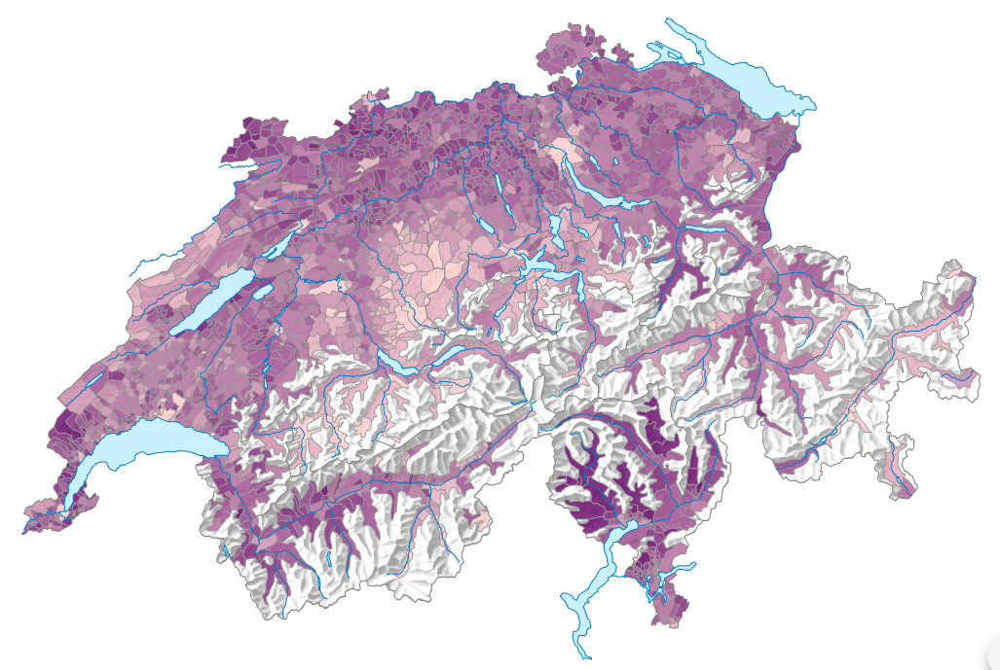

Title: Mass export data from STATATLAS
Date: 2024-05-26
Slug: statatlas-export



These days, I find it difficult to compare different municipalities with eachother.
The Federal Statistical Office (BFS) does publish many data, but it is hard to collect various data from
* a) each municipality in Swizterland (location)
* b) over multiple years (time)
* c) over multiple indicators (scope)

The [STATATLAS (statistical atlas)](https://www.atlas.bfs.admin.ch/de/index.html) gives a great overview over multiple indicators, over time, for municipalities, regions or cantons.
Unfortunately, there is currently no possibility to download all the underlying data at once. Especially to download multiple yars for one indicator, I had to click on the download button for each year by itself.

After asking the BFS, I got a hint: They have a [API called DAM-API](https://www.bfs.admin.ch/bfs/de/home/dienstleistungen/forschung/api/api-diffusion-dam.html), where the metadata of their data gets published.
And indeed, the data published on STATATLAS is also listed on this api:
```bash
curl --location --request GET 'https://dam-api.bfs.admin.ch/hub/api/dam/assets?articleModel=900052&spatialdivision=900004'
```
Whereas
* `articleModel=900052` stands for the STATATLAS product
* and `spatialdivision=900004` stands for data on municipality level

What was still missing is the data itself. By looking at the URL from the CSV download button, I got something like `https://www.atlas.bfs.admin.ch/core/projects/13/xshared/csv/26712_131.csv`, where `26712` is some kind of ID and `131` must stand for the selected language (when selecting French as language, I get `132`). When I can find this ID also in the DAM-API, I can mass download all indicators for all years on municipality level. In the field `shop.orderNr` i finally found then the reference between CSV name and the DAM-API.
That the data always comes in the same structure for all indicators on STATATLAS and years comes very handy, because I can now concat all dataframes over all indicators together with `pandas.concat`.

Columns of the exported CSV:
```bash
ipdb> df.columns
Index(['GEO_ID', 'GEO_NAME', 'VARIABLE', 'VALUE', 'UNIT', 'STATUS',
       'STATUS_DESC', 'DESC_VAL', 'PERIOD_REF', 'SOURCE', 'LAST_UPDATE',
       'GEOM_CODE', 'GEOM', 'GEOM_PERIOD', 'MAP_ID', 'MAP_URL'],
      dtype='object')
```

So, iterating over all indicators on municipality level and over all years on STATATLAS gives me the following dataset:

```bash
ipdb> df.info()
<class 'pandas.core.frame.DataFrame'>
Index: 2134923 entries, 0 to 4325
Data columns (total 16 columns):
 #   Column       Dtype  
---  ------       -----  
 0   GEO_ID       object 
 1   GEO_NAME     object 
 2   VARIABLE     object 
 3   VALUE        float64
 4   UNIT         object 
 5   STATUS       object 
 6   STATUS_DESC  object 
 7   DESC_VAL     object 
 8   PERIOD_REF   object 
 9   SOURCE       object 
 10  LAST_UPDATE  object 
 11  GEOM_CODE    object 
 12  GEOM         object 
 13  GEOM_PERIOD  object 
 14  MAP_ID       int64  
 15  MAP_URL      object 
dtypes: float64(1), int64(1), object(14)
memory usage: 276.9+ MB
```
Which I can then insert into the staging area of my database and use for later transformations and analysis. Job done.

## Links
* [Python script](https://github.com/fbardos/homelab_elt/blob/main/homelab_airflow/dags/bfs_statatlas/run_bfs_statatlas.py)
* [Airflow DAG](https://github.com/fbardos/homelab_elt/blob/main/homelab_airflow/dags/bfs_statatlas/dag_bfs_statatlas.py)
* [Swagger DAM API](https://dam-api.bfs.admin.ch/hub/swagger-ui/index.html)
